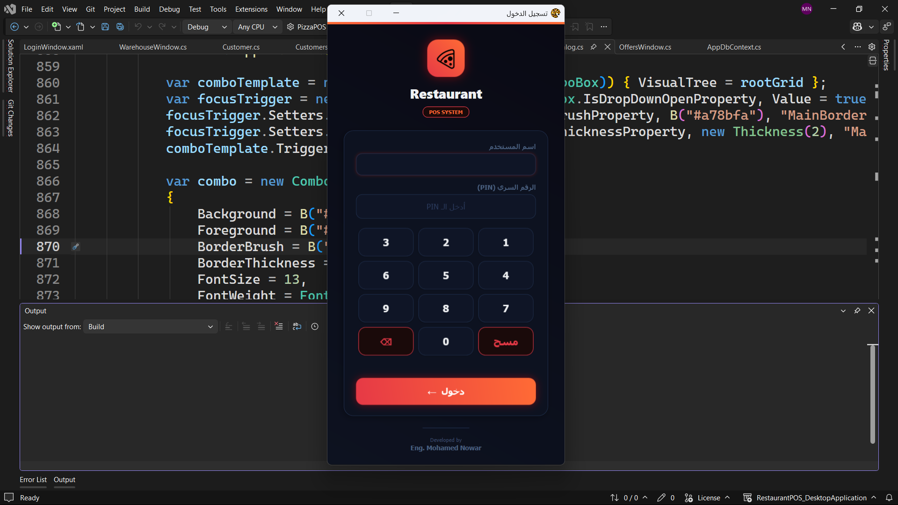
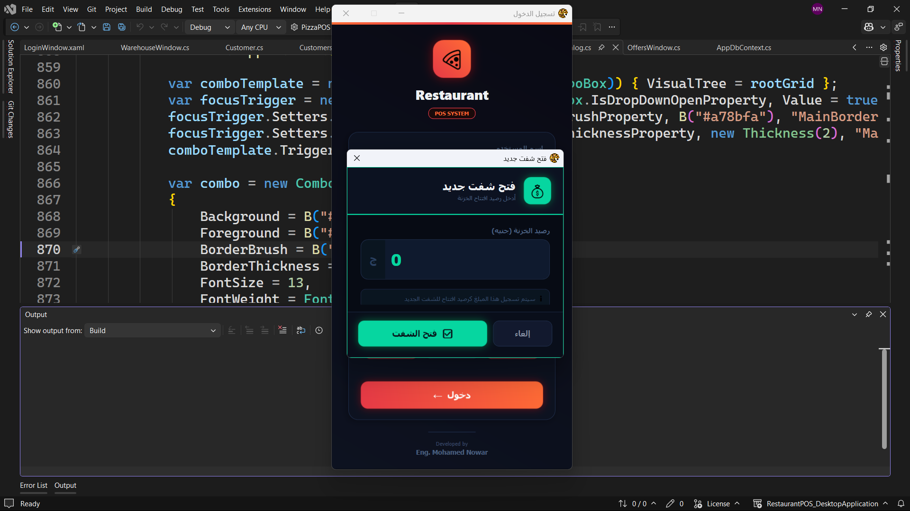
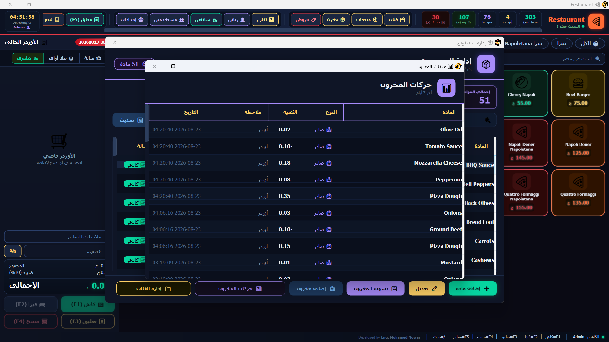

# NAPOLI Pizza — Restaurant POS Desktop Application

A full-featured **Point of Sale (POS)** desktop application built with **WPF** and **.NET 10**, designed for pizzerias and fast-food restaurants. Supports Arabic RTL UI, inventory management, shift tracking, delivery, WhatsApp promotions, and receipt printing on Epson (ESC/POS) printers.

---

## Features

### Point of Sale
- Product categories, items, sizes, and extras
- Discount support (percentage or fixed amount)
- Tax and service charge configuration
- Order types: Dine-In, Takeaway, Delivery
- Real-time order summary with item editing

### Product & Ingredient Management (Recipes)
- Link ingredients to products with quantities
- **Auto-calculate product cost** based on ingredient prices
- **Bulk price update** — increase all product prices by a percentage
- Ingredient stock tracking with low-stock alerts

### Warehouse Management
- Full ingredient inventory with stock levels
- Stock movement tracking (in/out/adjustment)
- Low stock warnings on startup
- Add/edit/delete ingredients
- **Add categories** directly from the warehouse screen
- **Set profit margin** — controls auto-pricing calculation

### Offers & Promotions
- Create promotional offers with title, description, discount %, and promo code
- Enable/disable offers
- **WhatsApp integration** — send offers directly to customers via WhatsApp
- Customer list with checkboxes for bulk sending
- Professional message format with shop branding

### Customer Loyalty Program
- Customer database with phone numbers
- Loyalty points system with tiers:
  - **Bronze** — under 1,000 points
  - **Silver** — 1,000 to 1,999 points
  - **Gold** — 2,000 to 4,999 points
  - **Diamond** — 5,000+ points
- Points earned per order

### Shift Management
- Open/close shift with cash drawer reconciliation
- Cash matching and discrepancy tracking
- Shift-based sales reporting

### Reporting & Analytics
- Daily sales reports
- Profit and loss tracking
- Waste/loss reporting
- **Excel export** using ClosedXML

### Printing
- ESC/POS receipt printing via USB/Serial
- Cash drawer integration
- Customer order details on receipt

### User Management
- Role-based access: **Admin** and **Cashier**
- PIN-based login (SHA256 with legacy migration)
- Admin-only features: settings, offers, reports, bulk price updates

### License Key System (Hardware Lock)
- **Hardware fingerprinting** — CPU, Motherboard, Disk Serial
- **License key validation** — keys are tied to specific hardware
- **Temporary keys** — trial period (30 days)
- **Permanent keys** — lifetime access
- Auto-check on startup with activation window
- **5-minute countdown** — app shuts down if not activated
- License generator tool for developers

### Settings
- Shop name, address, phone numbers
- Tax rate, service charge
- Profit margin configuration
- WhatsApp number for offers

### Developer Credit
- "Developed by Eng. Mohamed Nowar" in footer
- Clickable link to portfolio

---

## Screenshots

### Login & Shift

| | | |
|:---:|:---:|:---:|
|  |  |  |
| **Login** | **Open Shift** | **Close Shift** |

### Point of Sale

| | | |
|:---:|:---:|:---:|
|  |  |  |
| **POS (Admin)** | **POS (Cashier)** | **Product Sizes & Extras** |
|  |  |  |
| **Delivery Details** | **Cash Payment** | **Order Tracking Board** |
|  | | |
| **Held Orders** | | |

### Product & Category Management

| | | |
|:---:|:---:|:---:|
|  |  |  |
| **Category Management** | **Product Management** | **Add New Product** |
|  |  | |
| **Sizes & Extras** | **Product Recipe (Ingredients)** | |

### Warehouse Management

| | | |
|:---:|:---:|:---:|
|  |  |  |
| **Warehouse** | **Add New Ingredient** | **Ingredient Categories** |
|  |  | |
| **Stock Purchase** | **Stock Movements History** | |

### Offers & WhatsApp

| | |
|:---:|:---:|
|  |  |
| **Offers & Promotions** | **Send Offer via WhatsApp** |

### Reports & Analytics

| | | |
|:---:|:---:|:---:|
|  |  |  |
| **Daily Report** | **Top Products** | **Loss History** |

### Customer, Driver & User Management

| | | |
|:---:|:---:|:---:|
|  |  |  |
| **Customer Management** | **Driver Management** | **User Management** |

### Settings

| |
|:---:|
|  |
| **System Settings** |

---

## Tech Stack

| Technology | Purpose |
|------------|---------|
| C# / .NET 10 | Core language & runtime |
| WPF | Desktop UI framework |
| SQLite | Local database (via Microsoft.Data.Sqlite) |
| ClosedXML | Excel report export |
| System.IO.Ports | Serial printer communication |
| ESC/POS | Thermal printer protocol |
| HMACSHA256 | License key generation |
| WMI | Hardware fingerprinting |

---

## Project Structure

```
RestaurantPOS_DesktopApplication/
├── POS.slnx
├── PizzaPOS/
│   ├── Data/              # SQLite context & DatabaseHelper
│   ├── Helpers/           # UiHelper (shared UI components)
│   ├── Models/            # Entity classes & enums
│   ├── Services/          # Business logic (Inventory, Shift, User, License, etc.)
│   ├── ViewModels/        # MVVM view models
│   └── Views/             # WPF windows & dialogs
├── PizzaPOS.LicenseGenerator/  # Console tool for generating license keys
└── PizzaPOS.Tests/        # Unit tests
```

---

## Requirements

- Windows 10/11
- [.NET 10 SDK](https://dotnet.microsoft.com/download)

---

## Running the Application

```powershell
cd PizzaPOS
dotnet run
```

---

## Building for Distribution

```powershell
cd PizzaPOS
dotnet publish -c Release -r win-x64 --self-contained true `
  -p:PublishSingleFile=true `
  -p:IncludeNativeLibrariesForSelfExtract=true `
  -o ./publish
```

The executable will be in `PizzaPOS/publish/`.

---

## Generating License Keys

```powershell
cd PizzaPOS.LicenseGenerator
dotnet run
```

The tool will:
1. Ask for the Hardware ID (from the activation screen)
2. Ask for license type (Permanent or Trial)
3. Generate a license key

---

## Default Login Credentials

| User | PIN |
|------|-----|
| `admin` | `1234` |
| `cashier1` | `1234` |

> **Important:** Change the admin PIN immediately after first run in production.

---

## Database

- SQLite local database at: `%AppData%\PizzaPOS\pos.db`
- Tables and seed data are created automatically on first run
- License file stored at: `%AppData%\PizzaPOS\license.dat`

---

## License

MIT License — see [LICENSE.txt](LICENSE.txt)

---

## Developer

**Eng. Mohamed Nowar**
- Portfolio: [engmohamednowar.github.io/portfolio](https://engmohamednowar.github.io/portfolio/)
